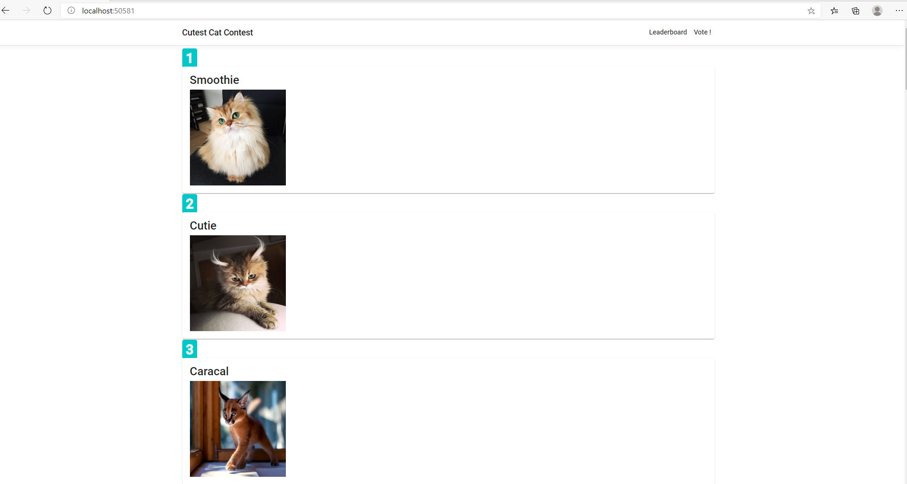
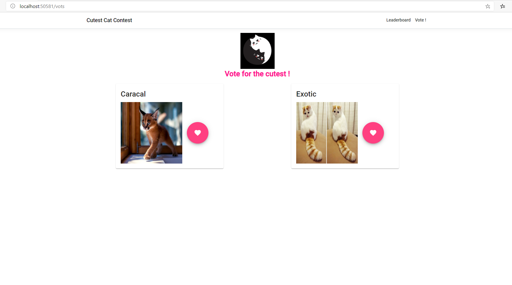

# CatMash
Simple Vote application for cats, 

full stack application:
Angular 9 
Asp core 3.1 

 - Front end (folder CoffeeClientApp): 
    - Angular 9 
    - Angular Material 9
 - Backend
   - ASP.NET Core 3.1 web API 
   - EF Core 3.1 (DbInitializer class seed the database data)
   - XUnit, use EF InMemory database to test services
   - Sql server localdb

Leaderboard: Cats sorted by vote numbers

Vote for the cutest between two random cats

